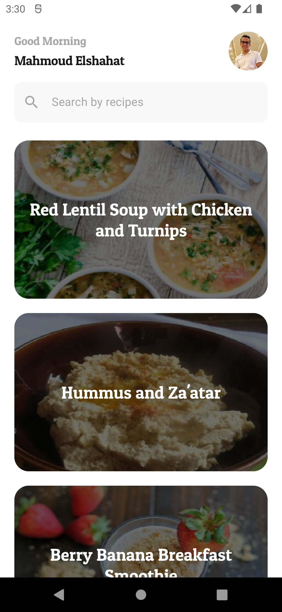
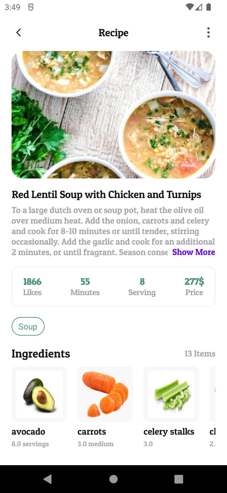

# Food Recipes
Android application that consuming (https://spoonacular.com/food-api) "Recipes api".  
It has been built with clean architecture principles, Repository Pattern, and MVVM pattern as well as Architecture Components.

## Demo
<table>
  <tr>
   <td> </td>
   <td> </td>
   <td> </td>
</tr> 
</table>

## Architecture
Uses concepts of the Uncle Bob's architecture [Clean Architecture](https://blog.cleancoder.com/uncle-bob/2012/08/13/the-clean-architecture.html). 

## Built With 🛠

- [Kotlin](https://kotlinlang.org/) First class and official programming language for Android development.
- [Coroutines](https://github.com/Kotlin/kotlinx.coroutines) - A coroutine is a concurrency design pattern that you can use on Android to simplify code that executes asynchronously
- [Flow](https://kotlin.github.io/kotlinx.coroutines/kotlinx-coroutines-core/kotlinx.coroutines.flow/) - Flow is used to pass (send) a stream of data that can be computed asynchronously
- [Dagger-Hilt](https://developer.android.com/training/dependency-injection/hilt-android) - For dependency injection.
- [JetPack](https://developer.android.com/jetpack) Suite of libraries to help developers follow best practices.
  - [Compose](https://developer.android.com/jetpack/compose) - Android’s recommended modern toolkit for building native UI. 
  - [Lifecycle](https://developer.android.com/jetpack/androidx/releases/lifecycle) - Used get lifecyle event of an activity or fragment and performs some action in response to change
  - [ViewModel](https://developer.android.com/topic/libraries/architecture/viewmodel) - Stores UI-related data that isn't destroyed on UI changes. 
  - [Room](https://developer.android.com/topic/libraries/architecture/room) - Used to create room db and store the data.
  - [Navigation](https://developer.android.com/guide/navigation/navigation-getting-started) - Used to navigate between fragments.
- [Retrofit](https://github.com/square/retrofit) - Used for REST api communication.
- [Pagination 3](https://developer.android.com/topic/libraries/architecture/paging/v3-overview) - Helps you load and display pages of data from a larger dataset.
- [Coil](https://coil-kt.github.io/coil/compose/) - Supported lib for loading images with jetpack compose. 

## TODO
- [ ] End to end test
- [ ] Unit test
- [ ] CI/CD (Github Actions, Bitrise, Fastlane)

## Contributions
Please feel free to file an issue for errors, suggestions or feature requests.

>> If you faced issue when trying build app, at first check versions of gradle and use a working values from your current projects
